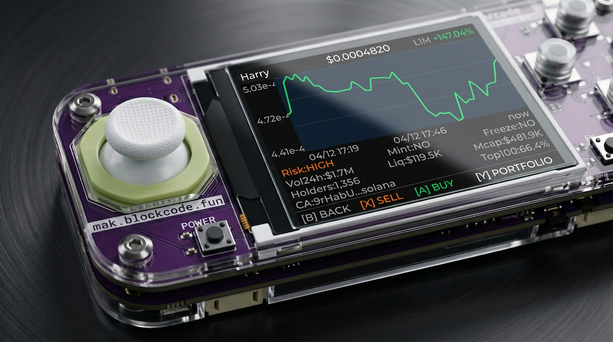
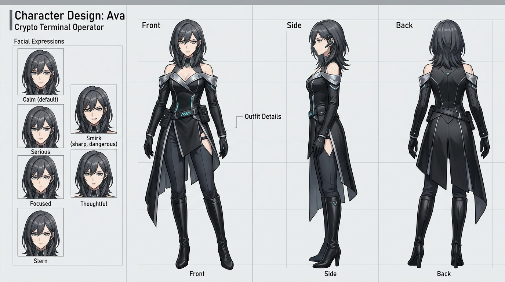

# Ava Box Solana ESP32 Monorepo

(English | [中文](README_zh.md))

This branch is the Solana-focused Ava Box build: ESP32 firmware, Python backend, shared LVGL screens, and the desktop simulator used to ship the same product flow on hardware and on PC.

Ava Box is a voice-driven handheld crypto terminal built on a Scratch Arcade style ESP32-S3 board with a `320x240` display, joystick navigation, physical confirmation buttons, wake word / PTT voice input, speaker output, and an AI operator persona named Ava. This branch narrows the product surface to Solana: SOL-native actions, Solana token discovery, Pump.fun hot/new feeds, wallet intelligence, watchlist flows, portfolio views, and trade confirmations.

Parts of the Ava Box backend and device-runtime stack are based on [`nulllaborg/xiaozhi-esp32`](https://github.com/nulllaborg/xiaozhi-esp32). The same architecture is designed to scale beyond the current Scratch Arcade target and can be extended to many ESP32 form factors, including watches, touch displays, robots, and other voice-enabled devices.

For the cloud-side capability layer and Skills integration, also see [`AveCloud/ave-cloud-skill`](https://github.com/AveCloud/ave-cloud-skill).

## Device preview



## Ava IP

Ava is the product IP and on-device operator persona for Ava Box: voice-first, screen-grounded, and designed for an always-available crypto terminal experience.



## Solana branch behavior

| Area | Behavior |
|---|---|
| Chain scope | `solana` only for feed, search, spotlight, watchlist, portfolio, orders, and trading |
| Platform feeds | Pump.fun only: `pump_in_hot` and `pump_in_new` |
| Native unit | SOL for market buy/sell, limit order, paper balances, and spoken amounts |
| Screen layer | Solana feed, spotlight, watchlist, portfolio, confirm, and result surfaces shared by firmware and simulator |
| Assistant routing | Ava keeps page context and selected cursor context while routing voice commands into Solana actions |

## What lives here

| Directory | Role |
|---|---|
| `firmware/` | ESP32 firmware runtime, board ports, audio pipeline, OTA, protocols, and Ava Box device integration |
| `server/` | backend stack, management services, Ava Box routing/tool logic, deployment docs, and server-side tests |
| `shared/` | shared Ava Box LVGL screens compiled into both firmware and simulator |
| `simulator/` | desktop validation harness for shared Ava Box UI and mock interaction flows |
| `docs/` | current product/reference documents |
| `config/` | repo-owned shared assets and small configuration artifacts |
| `data/` | local runtime data placeholder for non-committed state |
| `tmp/` | generated logs, local probes, and scratch artifacts used during debugging |

## Start here

| Task | Entry point |
|---|---|
| Bring up ESP32 runtime | [`firmware/README.md`](firmware/README.md), [`firmware/main/README.md`](firmware/main/README.md) |
| Work on Solana backend behavior | [`server/README_en.md`](server/README_en.md), [`server/main/README_en.md`](server/main/README_en.md) |
| Preview pages on desktop | [`simulator/README.md`](simulator/README.md), [`shared/ave_screens/README.md`](shared/ave_screens/README.md) |
| Understand shared UI contracts | [`shared/README.md`](shared/README.md) |
| Read product/reference docs | [`docs/README.md`](docs/README.md) |

## Architecture at a glance

```text
speech + input
  -> firmware/ (ESP32 runtime, board drivers, transport)
  -> server/main/xiaozhi-server/ (ASR, routing, tools, Solana-only Ava Box backend logic)
  -> shared/ave_screens/ (feed, spotlight, portfolio, watchlist, orders, result, etc.)
       -> compiled into firmware for hardware rendering
       -> compiled into simulator for desktop validation
```

Key Ava Box coupling points:

| Coupling point | Purpose |
|---|---|
| `shared/ave_screens/` | single source of truth for the Ava Box screen layer |
| `firmware/main/boards/scratch-arcade/` | active Scratch Arcade ESP32-S3 hardware target |
| `firmware/main/ave_transport_idf.cc` | bridges device events into the shared screen/runtime layer |
| `server/main/xiaozhi-server/plugins_func/functions/ave_tools.py` | Solana-only market, wallet, watchlist, portfolio, and order tools |
| `simulator/` | layout, navigation, mock scene, and regression validation before flashing hardware |

## Upstream origins

This monorepo is Ava Box-first, but several major directories are derived from upstream projects:

| Directory | Origin |
|---|---|
| `firmware/` | `78/xiaozhi-esp32` |
| `server/` | `xinnan-tech/xiaozhi-esp32-server` |
| `simulator/` | `lvgl/lv_port_pc_vscode` |
| cloud capability layer | [`AveCloud/ave-cloud-skill`](https://github.com/AveCloud/ave-cloud-skill) |

The READMEs in this repo describe those folders in terms of how Ava Box uses and customizes them for the Solana build.
